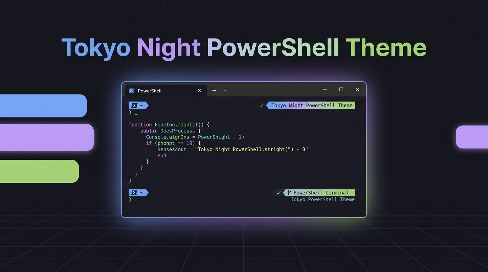

<p align="center">
  
</p>

<h1 align="center">🌃 Tokyo Night PowerShell Theme</h1>

<p align="center">
  <strong>An aesthetic, cohesive, and modern Tokyo Night dark theme designed for PowerShell 7+ & Windows PowerShell 5.1.</strong>
</p>

<p align="center">
  <a href="https://github.com/alien-software-development/powershell-tokyo-night-theme"></a>
  <a href="https://github.com/alien-software-development/powershell-tokyo-night-theme"></a>
  <a href="LICENSE"></a>
  <a href="https://github.com/alien-software-development/powershell-tokyo-night-theme/stargazers"></a>
  <a href="https://github.com/alien-software-development/powershell-tokyo-night-theme/issues"></a>
</p>

---

## ✨ Overview

Transform your bland blue or grey PowerShell terminal into a sleek, eye-pleasing **Tokyo Night** development environment with a single click.

This repository provides an automated, self-contained configuration installer that configures syntax highlighting, intelligent autocomplete styling, console registries, and optional Windows Terminal color schemes without requiring administrative privileges or tedious manual editing.

---

## ⚡ Features

- 🎨 **24-bit TrueColor Syntax Highlighting**: Custom ANSI escapes tuned for commands, parameters, strings, keywords, numbers, and errors.
- 🔍 **Interactive Selection**: Deep navy selection background (`#33467C`) with crystal white text for crystal clear visibility.
- 💡 **Predictive IntelliSense & History**: Inline and list prediction colors with arrow-key history search (`UpArrow`/`DownArrow`) and tab completion.
- 🌿 **Git-Aware Prompt**: Displays your current directory, active Git branch (highlighted in golden yellow), and status-coded exit indicators.
- 🖥️ **Windows Console & Registry Sync**: Configures `HKCU:\Console` 16-color tables so standard console windows (`conhost.exe`, `powershell.exe`, `pwsh.exe`) inherit true Tokyo Night colors.
- 🪟 **Windows Terminal Integration**: Automatically detects and injects the Tokyo Night color scheme into your Windows Terminal `settings.json`.
- 📦 **1-Click Offline Portability**: Zero dependencies. Runs on any Windows PC via double-click.

---

## 🚀 Quick Start & Installation

### Option 1: One-Line Remote Install (Fastest)

Open any PowerShell prompt and run:

```powershell
irm https://raw.githubusercontent.com/alien-software-development/powershell-tokyo-night-theme/main/Apply-Theme.ps1 | iex
```

---

### Option 2: 1-Click Offline Batch (Portable)

1. Clone or download this repository:
   ```cmd
   git clone https://github.com/alien-software-development/powershell-tokyo-night-theme.git
   ```
2. Double-click **`Apply-PowerShell-Theme.bat`** (or `Apply-Theme.bat`).
3. Open a new PowerShell window to enjoy your new theme!

---

### Option 3: Manual PowerShell Script

```powershell
Set-ExecutionPolicy -Scope Process -ExecutionPolicy Bypass
.\Apply-Theme.ps1
```

---

## 🎨 Palette Reference

| Role | Color Preview | Hex Code | Purpose |
| :--- | :--- | :--- | :--- |
| **Background** | `rgb(22, 22, 30)` | `#16161E` | Terminal background |
| **Foreground / Text** | `rgb(192, 202, 245)` | `#C0CAF5` | Default text & punctuation |
| **Selection** | `rgb(51, 70, 124)` | `#33467C` | Highlighted text background |
| **Command** | `rgb(122, 162, 247)` | `#7AA2F7` | Cmdlets, functions, binaries |
| **Parameter** | `rgb(187, 154, 247)` | `#BB9AF7` | Flags (`-Path`, `-Force`) |
| **String** | `rgb(158, 206, 106)` | `#9ECE6A` | Single & double quoted strings |
| **Number** | `rgb(224, 175, 104)` | `#E0AF68` | Numeric literals & Git branch |
| **Variable** | `rgb(255, 158, 100)` | `#FF9E64` | Variables (`$profile`, `$host`) |
| **Type** | `rgb(42, 195, 222)` | `#2AC3DE` | Class types (`[System.Text]`) |
| **Comment** | `rgb(110, 115, 141)` | `#6E738D` | Inline & block comments |
| **Error** | `rgb(247, 118, 142)` | `#F7768E` | Syntax error & failed commands |

---

## 📁 Repository Structure

```text
powershell-tokyo-night-theme/
├── assets/
│   └── banner.png                     # Header graphic
├── Apply-PowerShell-Theme.bat         # Single-file self-contained batch launcher
├── Apply-Theme.bat                    # Standard companion batch runner
├── Apply-Theme.ps1                    # Main PowerShell installer script
├── LICENSE                            # MIT License
└── README.md                          # Documentation
```

---

## 🔧 What Gets Modified?

The installer creates or updates the following paths on your machine:

1. **PowerShell 7 Profile**:
   `$HOME\Documents\PowerShell\Microsoft.PowerShell_profile.ps1`
2. **Windows PowerShell 5.1 Profile**:
   `$HOME\Documents\WindowsPowerShell\Microsoft.PowerShell_profile.ps1`
3. **User Console Registry**:
   `HKCU:\Console` & application subkeys (`ColorTable00` - `ColorTable15`, `CursorColor`, `ScreenColors`)
4. **Windows Terminal (Optional)**:
   `%LOCALAPPDATA%\Packages\Microsoft.WindowsTerminal_8wekyb3d8bbwe\LocalState\settings.json`

> **Note**: Your existing profile files will be safely updated. No administrative permissions (`Run as Administrator`) are required.

---

## 🛠️ Uninstallation / Reset

If you ever wish to revert:
1. Delete or clear the lines inside:
   * `Documents\PowerShell\Microsoft.PowerShell_profile.ps1`
   * `Documents\WindowsPowerShell\Microsoft.PowerShell_profile.ps1`
2. In PowerShell, delete registry subkeys:
   ```powershell
   Remove-Item "HKCU:\Console\PowerShell" -ErrorAction SilentlyContinue
   Remove-Item "HKCU:\Console\pwsh" -ErrorAction SilentlyContinue
   ```

---

## 🤝 Contributing

Contributions, feature requests, and suggestions are welcome!
Feel free to open an issue or submit a Pull Request.

---

## 📄 License

This project is licensed under the [MIT License](LICENSE).

---

## 📞 24/7 Enterprise Sales & Technical Support

- **🌐 Official Website:** [https://aliensoftwaredevelopment.com](https://aliensoftwaredevelopment.com)
- **📱 Direct Hotline / WhatsApp:** **`+8801710978997`** (👉 [Click to Chat on WhatsApp](https://wa.me/8801710978997))
- **💻 Instant Live Demo & Remote Setup:** Available daily via AnyDesk / TeamViewer.
- **💳 Accepted Payment Methods:** bKash (Personal/Merchant), Nagad, Rocket, Bank Wire Transfer, Visa / Mastercard, and USDT (Crypto TRC-20).

---

<div align="center">

**Developed with ❤️ by [Alien Software Development](https://aliensoftwaredevelopment.com)**  
*Transforming Businesses with Intelligent Software & Enterprise Automation.*

</div>
